# Stacks

A library book borrowing app for Android, built with Kotlin, Jetpack Compose and Firebase (Auth + Firestore).

Members can browse the catalog, borrow books and return them. Librarians get a dashboard, can manage the catalog and check books back in at the desk. Everything updates in real time, so when someone borrows a book the librarian sees it straight away.

<p>
  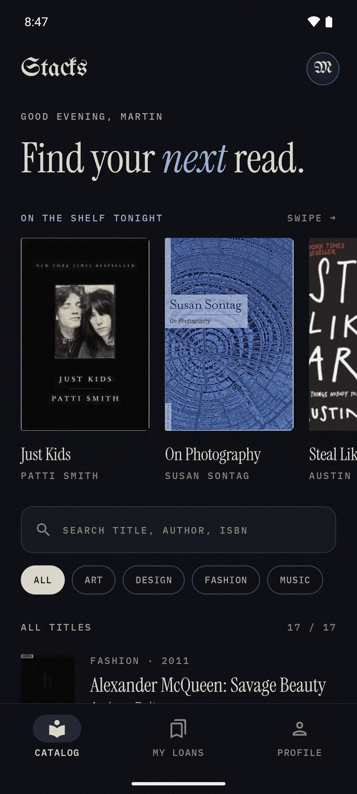
  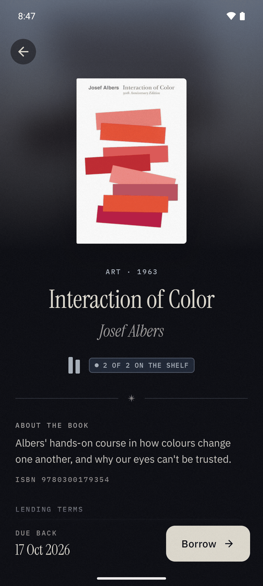
  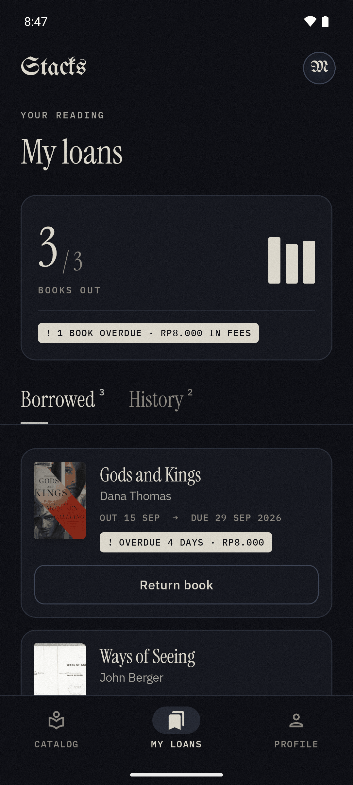
  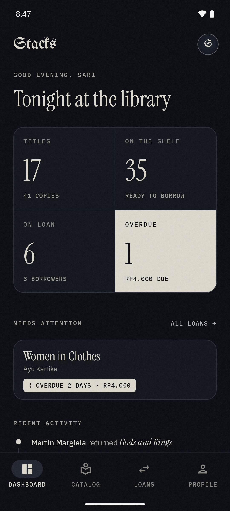
</p>

## Try it

**APK:** grab `stacks-v1.1.0.apk` from the [latest release](../../releases/latest) and install it on any Android 8.0+ phone. It's connected to a live demo Firebase project, so you can log in right away.

**Demo accounts** (password for both is `stacks123`):

| Role | Email |
| --- | --- |
| Librarian | `librarian@stacks.test` |
| Member | `margiela@stacks.test` |

The member account (Martin Margiela) already has some history: a couple of books out, one of them overdue, and a few returns. You can also just create a new account from the login screen.

**From source:** you need Android Studio, or JDK 17+ and the Android SDK with platform 37.

```bash
git clone https://github.com/SuperUrus911/library-borrowing-app.git
cd library-borrowing-app
./gradlew installDebug
```

`app/google-services.json` points to the demo project, so it runs as is.

## Features

**Members**
- Sign up / log in with email and password
- Browse the catalog, search by title, author or ISBN, filter by category
- See how many copies are on the shelf and borrow with one tap
- My loans: due dates, overdue warnings and late fees
- Return books and look back at your history
- Profile with a few reading stats

**Librarians**
- Dashboard with titles, copies on the shelf, active loans and overdue loans
- Add, edit and delete books. The cover gets pulled from Open Library using the ISBN
- See who has each copy and when it's due
- Loans screen: filter by on loan / overdue / returned, search by member or book, mark books as returned
- "Load sample books" button for an empty catalog

**Lending rules** (in [`LibraryPolicy.kt`](app/src/main/java/dev/ijlal/stacks/data/LibraryPolicy.kt))

| Rule | Value |
| --- | --- |
| Loan period | 14 days |
| Max books per member | 3 |
| Same title twice at once | not allowed |
| Late fee | Rp2.000 per day |

## Screenshots

### Member

| Login | Sign up | Catalog | Filter |
| --- | --- | --- | --- |
| 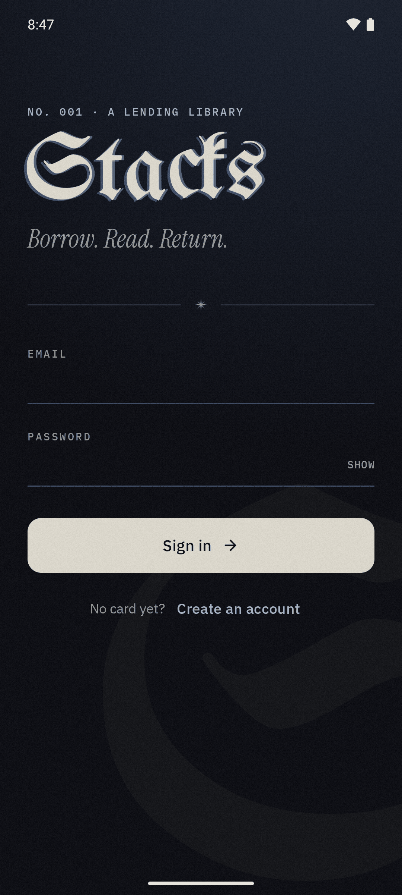 | 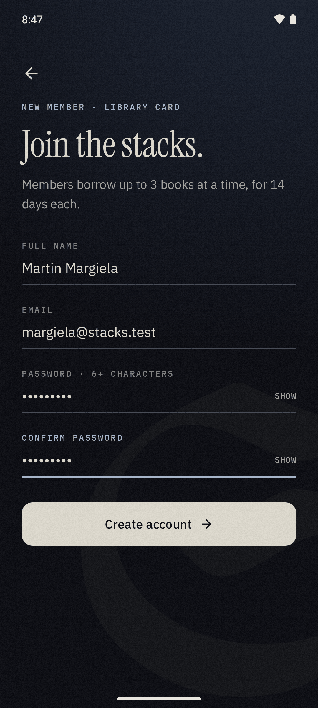 |  | 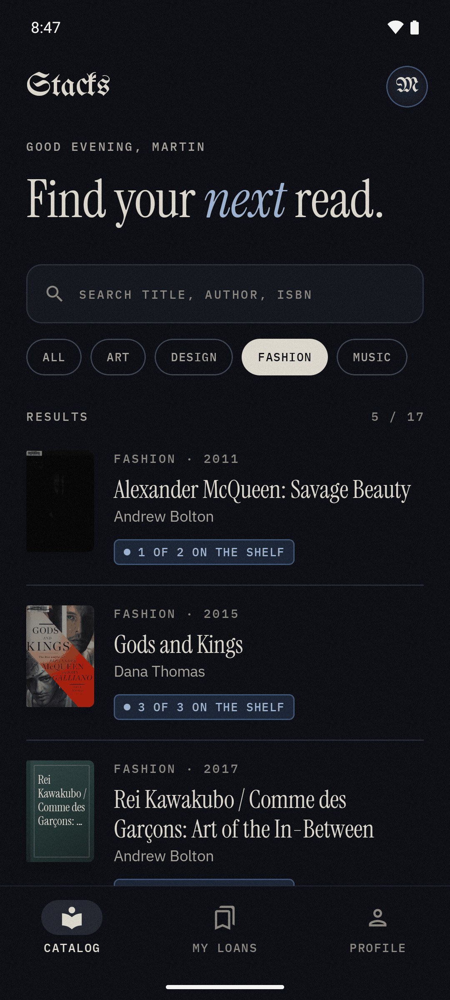 |

| Book detail | Borrow | Borrowed | My loans |
| --- | --- | --- | --- |
|  | 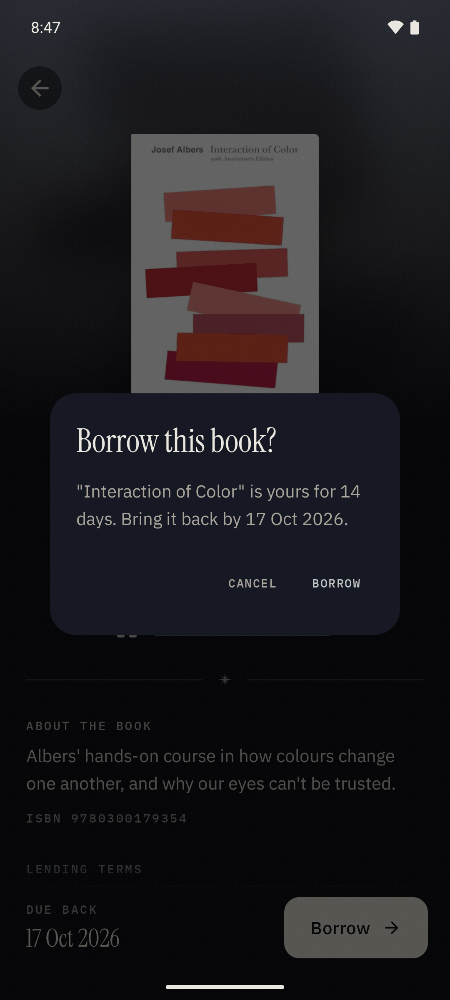 | 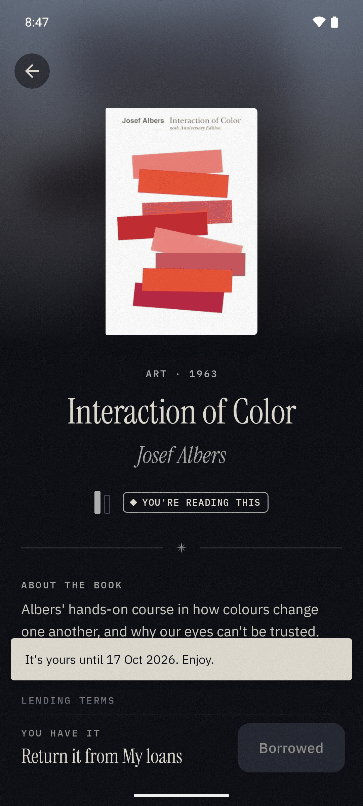 |  |

| Return | History | Profile | Limit reached |
| --- | --- | --- | --- |
| 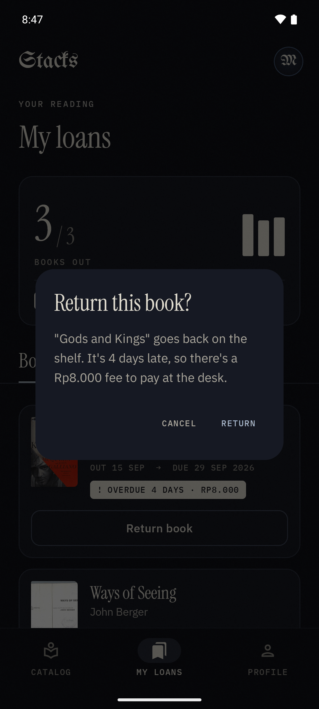 | 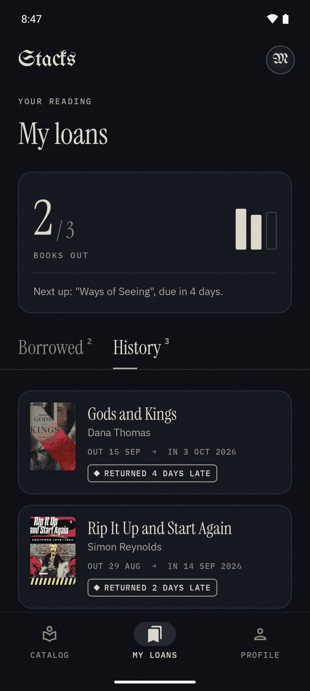 | 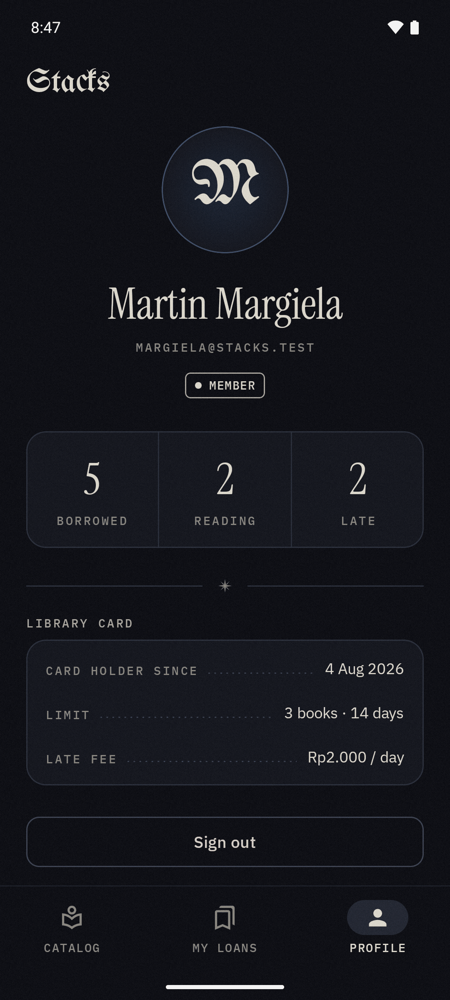 | 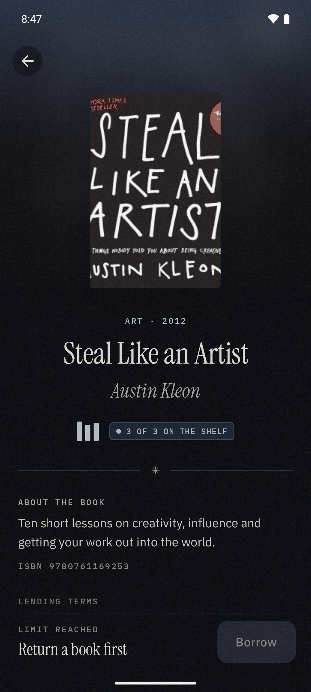 |

### Librarian

| Dashboard | Catalog | Book detail | Add a book |
| --- | --- | --- | --- |
|  | 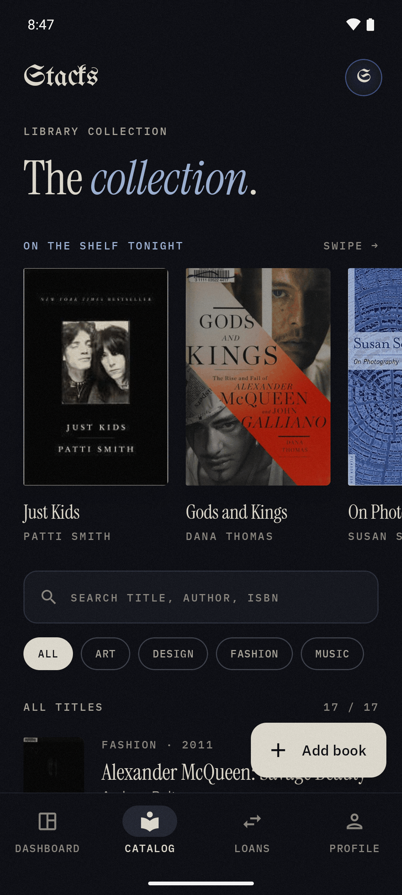 | 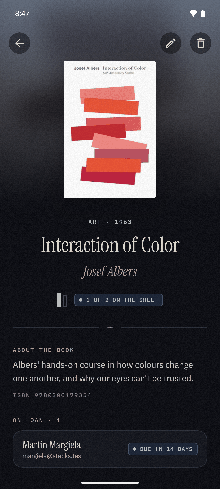 | 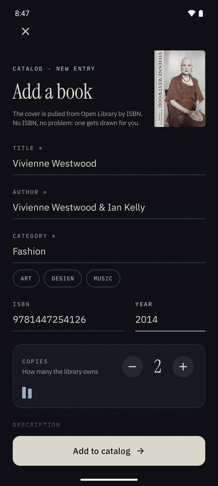 |

| Loans | Overdue | Check in | Profile |
| --- | --- | --- | --- |
| 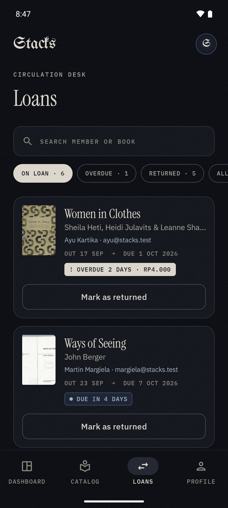 | 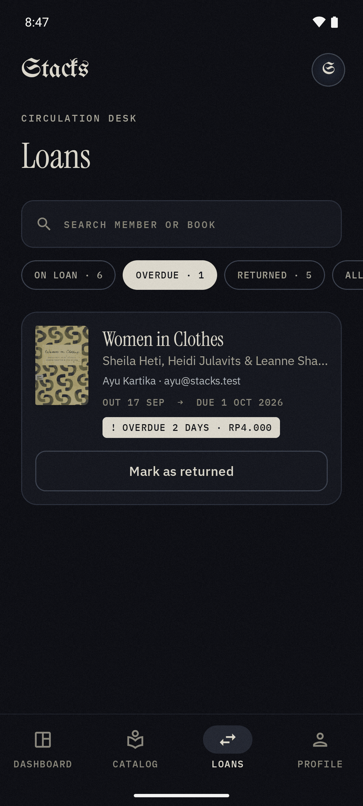 | 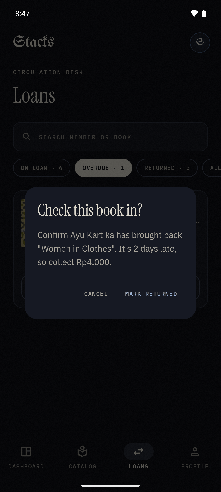 | 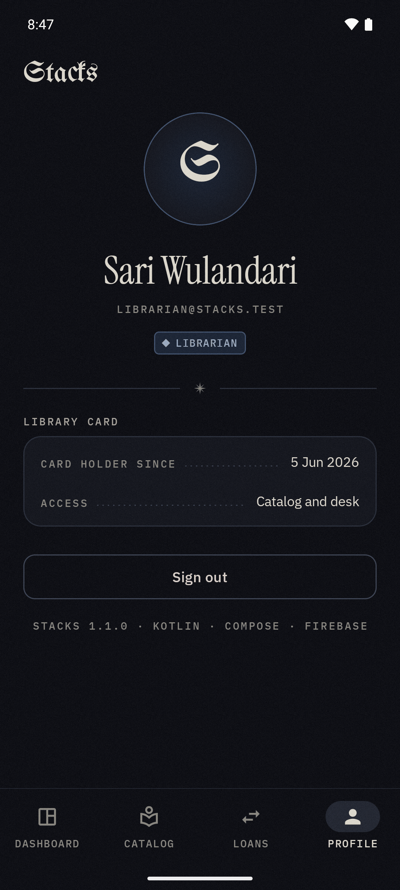 |

## How it works

```
app/src/main/java/dev/ijlal/stacks
├── data/                 Firebase access + business rules
│   ├── model/Models.kt   UserProfile, Book, Loan
│   ├── AuthRepository    auth state + the user's profile as one Session flow
│   ├── BookRepository    catalog CRUD
│   ├── LoanRepository    borrow / return (Firestore transactions)
│   ├── LibraryPolicy     loan period, limits, late fees, due dates
│   └── AppContainer      manual DI
└── ui/                   Compose screens, one ViewModel each
    ├── auth/  catalog/  book/  loans/  admin/  profile/
    ├── home/             nav graph + bottom bar per role
    ├── components/       covers, loan cards, tags, fields, etc.
    └── theme/            colours, fonts, shapes
```

A few things worth pointing out:

- **MVVM with Flows.** Repositories turn Firestore snapshot listeners into Kotlin Flows, the ViewModels combine them into `StateFlow` UI state, and Compose renders it. No refresh buttons needed.
- **One app, two roles.** The `role` field on the user doc decides which bottom bar you get: Catalog / My loans / Profile for members, Dashboard / Catalog / Loans / Profile for librarians.
- **Stock can't go out of sync.** Borrowing reads the book and the member, then writes the loan, the stock change and the member's active list in a single transaction. Two people can't take the last copy, and double tapping can't get you past the 3-book limit. Returning undoes all three in one go.
- **Security rules** ([`firestore.rules`](firestore.rules)) enforce the same thing on the server. Members only see their own profile and loans, can only move a book's stock by one, and can only create a loan in the same transaction that takes a copy off the shelf. Only librarians can edit the catalog or other people's loans.
- **Covers** come from the Open Library Covers API (loaded with Coil). If a book has no cover, the app draws one.

### Firestore

| Collection | Fields |
| --- | --- |
| `users/{uid}` | `name`, `email`, `role` (`member` / `admin`), `activeBookIds[]`, `createdAt` |
| `books/{id}` | `title`, `author`, `isbn`, `category`, `publishedYear`, `description`, `totalCopies`, `availableCopies`, `createdAt` |
| `loans/{id}` | `bookId`, `bookTitle`, `bookAuthor`, `bookIsbn`, `userId`, `userName`, `userEmail`, `status` (`BORROWED` / `RETURNED`), `borrowedAt`, `dueAt`, `returnedAt` |

Loans keep a copy of the book title and member name, so the lists don't need extra reads and old loans still make sense if a book gets deleted.

## Design

I wanted it to feel like a library after closing time rather than a generic Material app. It's dark only: blue-black background, cream text and a light blue accent, with a bit of film grain on top. There are no warm colours, so instead of turning things red, overdue loans flip to a solid cream tag that stands out against everything else.

Type is doing most of the work:
- [UnifrakturMaguntia](https://fonts.google.com/specimen/UnifrakturMaguntia) (blackletter) for the logo and the profile monogram only
- [Instrument Serif](https://fonts.google.com/specimen/Instrument+Serif) for titles
- [IBM Plex Sans](https://fonts.google.com/specimen/IBM+Plex+Sans) for body text
- [IBM Plex Mono](https://fonts.google.com/specimen/IBM+Plex+Mono) in small caps for labels, a bit like the stamps on an old library card

All fonts are under the SIL Open Font License and bundled in `res/font`.

Small details: copies are drawn as little book spines (filled = on the shelf), loan cards have an "OUT / DUE" stamp line, and the book page uses a blurred copy of the cover as its background.

## Using your own Firebase project

1. Create a Firebase project and add an Android app with package name `dev.ijlal.stacks`.
2. Download `google-services.json` into `app/` (replace the existing one).
3. Turn on **Authentication > Sign-in method > Email/Password**.
4. Create a **Cloud Firestore** database and deploy the rules:
   ```bash
   firebase use --add <your-project-id>
   firebase deploy --only firestore
   ```
5. Sign up in the app, then make that account a librarian by setting `role` to `"admin"` on its `users/{uid}` doc in the Firestore console.
6. Log in as the librarian and tap **Load sample books**.

## Stack

| | |
| --- | --- |
| Language | Kotlin 2.4 |
| UI | Jetpack Compose, Material 3, Navigation Compose |
| Async | Coroutines + Flow |
| Backend | Firebase Auth, Cloud Firestore (BoM 34) |
| Images | Coil 3 |
| Build | Gradle 9.8 (Kotlin DSL, version catalog), AGP 9.4 |
| Min / target SDK | 26 (Android 8.0) / 36 |
